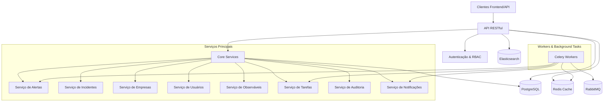

# Arquitetura do Sistema

O SentinelIQ adota uma arquitetura modular, resiliente e escalável, projetada para ambientes enterprise. Esta seção fornece uma visão geral dos principais componentes e como eles interagem entre si.

## Diagrama de Arquitetura

## Componentes de Infraestrutura

| Componente | Tecnologia | Descrição |
|------------|------------|-----------|
| **Banco de Dados** | PostgreSQL | Armazenamento persistente com isolamento por tenant |
| **Cache** | Redis | Cache de alta performance e filas de tarefas |
| **Message Broker** | RabbitMQ | Gerenciamento de filas para processamento assíncrono |
| **Busca** | Elasticsearch | Indexação e busca de alta performance |
| **Containers** | Docker | Implantação isolada e consistente |
| **Backend** | Django/DRF | Framework robusto para API Rest |
| **Workers** | Celery | Execução de tarefas em background |

## Componentes do Núcleo

A plataforma SentinelIQ é baseada em vários componentes de núcleo que fornecem a infraestrutura básica para todos os serviços:

### API Core

O módulo `api.core` contém componentes fundamentais que são usados em toda a aplicação:

- **Respostas Padrão**: `api.core.responses` fornece formatação consistente para todas as respostas da API
- **RBAC**: `api.core.rbac` implementa controle de acesso baseado em função
- **Middleware**: `api.core.middleware` para processamento de requisições
- **Paginação**: `api.core.pagination` para consistência em listagens
- **Exceções**: `api.core.exceptions` para tratamento padronizado de erros
- **Auditoria**: `api.core.audit` para registro de todas as ações

### Isolamento Multi-Tenant

Cada empresa é isolada por design:

- Isolamento a nível de dados usando filtros por empresa
- Permissões específicas por empresa
- Ambientes de processamento separados
- Notificações e configurações independentes

### Segurança e Auditoria

A segurança é implementada em múltiplas camadas:

- **Autenticação**: Token JWT com expiração e rotação
- **Autorização**: RBAC granular baseado em empresa/recurso/ação
- **Auditoria**: Registro detalhado de todas as operações
- **Sensibilidade**: Mascaramento de dados sensíveis em logs
- **Criptografia**: TLS para todo tráfego externo

## Fluxo de Processamento

1. **Requisição recebida**: Cliente faz requisição para a API
2. **Autenticação**: Validação de token e identidade
3. **Autorização**: Verificação de permissões RBAC
4. **Processamento**: Execução da lógica de negócio
5. **Auditoria**: Registro da ação realizada
6. **Resposta**: Envio da resposta padronizada
7. **Background**: Tarefas assíncronas via Celery (se necessário)

## Escalabilidade

A arquitetura foi projetada para escalar horizontalmente:

- Serviços stateless para facilitar replicação
- Caching distribuído com Redis
- Filas de mensagens para desacoplamento
- Workers especializados por tipo de tarefa
- Sharding por empresa para isolamento de carga 