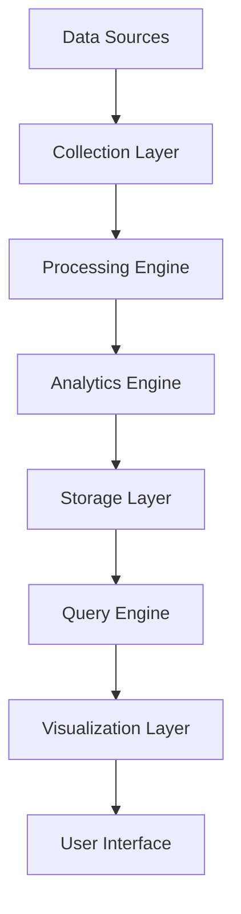

# SentinelVision Overview

SentinelVision is an advanced Security Information and Event Management (SIEM) platform that provides real-time visibility into your security operations.

## Features

* **Real-time Monitoring**  
  Monitor security events in real-time across your entire infrastructure. Collect, normalize, and analyze logs from multiple sources.

* **Advanced Analytics**  
  Apply machine learning and behavioral analytics to detect threats. Identify anomalies and patterns that indicate potential security incidents.

* **Threat Detection**  
  Detect and prioritize security threats using built-in detection rules. Create custom detection rules based on your environment.

* **Incident Investigation**  
  Investigate security incidents with powerful search and visualization tools. Timeline analysis and event correlation help identify root causes.

* **Compliance Reporting**  
  Generate compliance reports for various standards (PCI DSS, HIPAA, SOX, etc.). Track security metrics and KPIs through customizable dashboards.

* **Integration Framework**  
  Integrate with SentinelIQ and Cortex for automated response. Connect with other security tools through APIs and plugins.

## Core Components

### Data Collection

* Log Collection
* Network Flow Analysis
* System Metrics
* Application Logs
* Security Events
* Custom Sources

### Analysis Engine

* Real-time Processing
* Machine Learning
* Behavioral Analytics
* Correlation Rules
* Custom Analytics

### Visualization

* Real-time Dashboards
* Interactive Charts
* Event Timeline
* Network Maps
* Custom Reports

## Architecture

## Integration

* SentinelIQ Integration
* Cortex Integration
* SIEM Integration
* Custom Integration

## Use Cases

### 1. Security Monitoring
* Real-time threat detection
* Behavioral analysis
* Anomaly detection
* Alert correlation

### 2. Compliance
* Audit logging
* Compliance reporting
* Policy enforcement
* Access monitoring

### 3. Incident Response
* Automated investigation
* Root cause analysis
* Incident timeline
* Response automation

## Getting Started

1. [Download SentinelVision](download.md)
2. Follow the [Installation Guide](installation/quickstart.md)
3. Configure [Data Sources](user-guides/data-sources.md)
4. Explore [Dashboards](user-guides/dashboards.md)

## Support

For additional support:

- Check the [Release Notes](../release-notes.md) for latest updates
- Review the [API Documentation](api/documentation.md)
- Contact support at support@sentineliq.com 